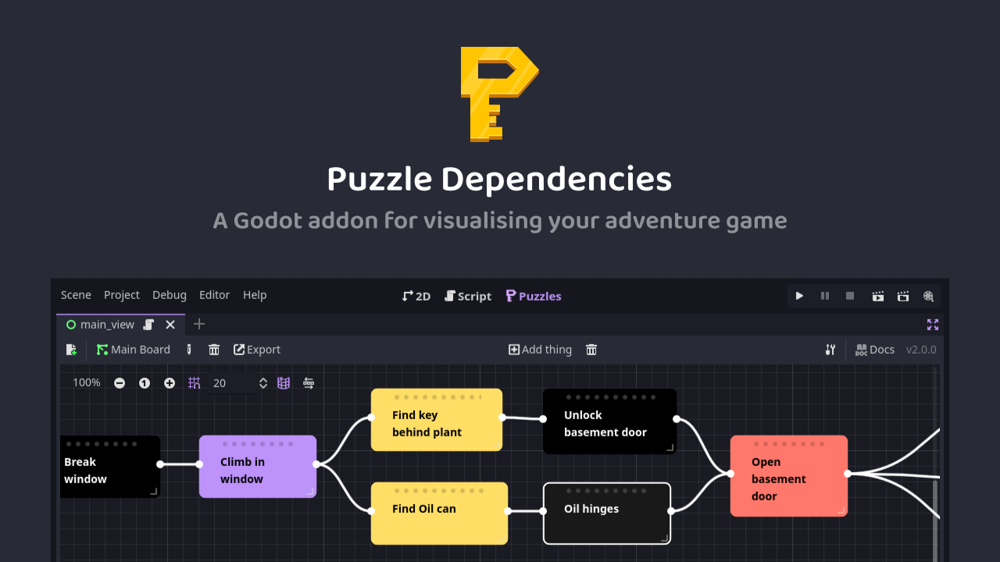
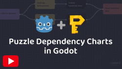

A tool for making [puzzle dependency charts](https://www.grumpygamer.com/puzzle_dependency_charts) for adventure games made with [Godot Game Engine](https://godotengine.org/). 

## Installation

1. Clone or download a copy of this repository.
2. Copy the contents of `addons/puzzle_dependencies` into your `res://addons/puzzle_dependencies` directory.
3. Enable `Puzzle Dependencies` in your project plugins.

## Documentation

- [Making a chart](docs/Things.md)

## Introduction

## Discord

## Contributors

Puzzle Dependencies is made by [Nathan Hoad](https://nathanhoad.net).

## License

Licensed under the MIT license, see `LICENSE` for more information.
