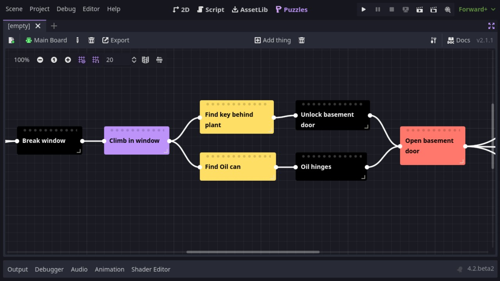

# Puzzle Dependencies _for Godot 4_

A tool for making [puzzle dependency charts](https://www.grumpygamer.com/puzzle_dependency_charts) for adventure games made with [Godot 4](https://godotengine.org/).

You can install it via the Asset Library or [downloading a copy](https://github.com/nathanhoad/godot_puzzle_dependencies/archive/refs/heads/main.zip) from GitHub.

 

## Documentation

- [Making a chart](docs/Things.md)

## Introduction

## Contributors

Puzzle Dependencies is made by [Nathan Hoad](https://nathanhoad.net) with help from [these cool people](https://github.com/nathanhoad/godot_puzzle_dependencies/graphs/contributors).

## License

Licensed under the MIT license, see `LICENSE` for more information.
