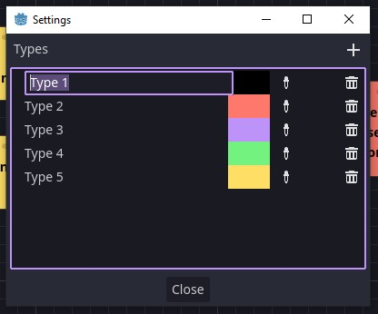

# Making a chart

Puzzle dependency charts are made up of "boards" and "things". Things can be one of a few different types which gives them a colour.

## Settings

To set up your thing types, click on the settings icon at the top right of the board.

From there you can rename and change the colours of the types.

## Boards & things

Boards are the puzzle depency charts themselves and things are the steps for each piece of a puzzle.

If you don't already have a board you can add one by clicking the new board button:

Once you have a board you can add things in a few different ways.

You can click the "add thing" button at the top of the board or right click on the board to add a thing of a specific type.

Now that you have a thing you can click into it to set some text.

Dragging out from the white dots on either side of the thing will create a dependency to another thing. It's up to you if dependencies go from left to right.

Right click on a thing to change its type, disconnect dependencies, or remove the thing entirely.

You can also move things around and resize them.

If you accidentally do something you didn't mean to you can make use of Godot's undo/redo.